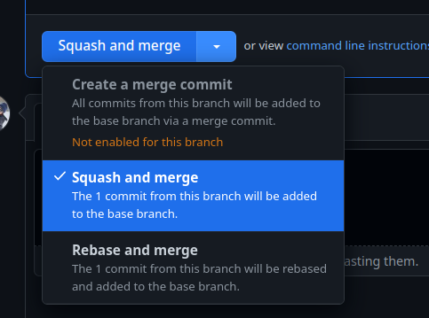

# Contributing guidelines

<!-- vim-markdown-toc GFM -->

- [Contributing guidelines](#contributing-guidelines)
  - [Development](#development)
    - [System prerequisites](#system-prerequisites)
    - [Dev environment set up](#dev-environment-set-up)
  - [SAML Accounts to use in Dev](#saml-accounts-to-use-in-dev)
  - [`.env` and `./dev-secrets/*`](#env-and-dev-secrets)
    - [Usage](#usage)
  - [Pull requests](#pull-requests)
  - [End-to-end tests](#end-to-end-tests)
    - [Debugging CI failures](#debugging-ci-failures)
  - [Merging to main](#merging-to-main)
    - [Stages: Draft and Ready for review](#stages-draft-and-ready-for-review)

<!-- vim-markdown-toc -->

## Development

### System prerequisites

This project requires:

- [docker](https://docs.docker.com/get-docker/)
- [nodejs LTS (20)](https://nodejs.org/en/download/)
- [npm](https://docs.npmjs.com/downloading-and-installing-node-js-and-npm)

Optional:

- [Use a node version manager](https://docs.npmjs.com/downloading-and-installing-node-js-and-npm#using-a-node-version-manager-to-install-nodejs-and-npm)

### Dev environment set up

```bash
# Create an .env based on the example
$ cp .env.example .env

# Start MySQL in docker
$ docker compose up -d
# Wait for the db to finish starting, it takes a few seconds before it's ready...

# Install all dependencies
$ npm install

# Setup the database
$ npm run setup

# (Optional) Setup test database
$ npm run setup:test

# Generate a build folder the first time running the app
$ npm run build

# Start the app, which will be running on localhost:8080
$ npm run dev

# Visually see the database in a GUI:
$ npm run db:studio

# Visually see the test database in a GUI
$ npm run db:studio:test

# Stop and remove containers
docker compose down
```

> **Note** `npm run setup` creates a local `mysql-data/` directory, and is a one time setup. That directory can be safely deleted if the database needs to be reset, or if errors occur during database startup.

> **Note** `npm run build` needs to be executed the first time running the project. As it generates a `build/server.js` script that `npm run dev` depends on. Subsequent times, only `npm run dev` is needed to run the app in development mode.

> **Note** `npm run setup:test` is required for running tests locally

## SAML Accounts to use in Dev

Our IDP is configured with a few accounts that exist for testing, the usernames and passwords to use are as follows:

| user     | pass      |
| -------- | --------- |
| user1    | user1pass |
| user2    | user2pass |
| user3    | user3pass |
| han.solo | starchart |

They can be configured in `./config/simplesamlphp-users`

## `.env` and `./dev-secrets/*`

Some application configuration is managed via environment variables, others as secrets (i.e., files).

Your `.env` file should define any environment variables you want to use via `process.env.*`. For example, the line `MY_ENV_VAR=data` in `.env` will mean that `process.env.MY_ENV_VAR` is available at runtime with `data` as its value.

For secrets, we use the [docker-secret](https://github.com/hwkd/docker-secret) module to load and expose secrets via Docker Swarm's [secrets](https://docs.docker.com/engine/swarm/secrets/), which are files that get mounted into the container at `/run/secrets/*`.

In development, if you want to override the Docker secrets used by the app,
set the following in your env: `SECRETS_OVERRIDE=1` (we do this automatically
in many development/testing scripts in `package.json`). This will
load secrets from `./dev-secrets/*` instead of using Docker Swarm secrets. The `./dev-secrets/*` folder contains files we want to expose as secrets to the running app.

### Usage

If you need to add a secret, for example, a secret named `MY_SECRET` with a value of `this-is-secret`:

1. Create a new file `dev-secrets/MY_SECRET` with contents `this-is-secret`
2. In your code, `import secrets from '~/lib/secrets.server'`
3. Use your secret, `secrets.MY_SECRET`

## Pull requests

- To avoid duplicate work, create a draft pull request.
- Avoid cosmetic changes to unrelated files in the same commit.
- Use a [feature branch](https://www.atlassian.com/git/tutorials/comparing-workflows) instead of the main branch.

## End-to-end tests

We use [Playwright](https://playwright.dev/) for end-to-end testing. For a brief overview of how to use Playwright, you can also go to our [wiki page](https://github.com/DevelopingSpace/starchart/wiki/Playwright).

### Debugging CI failures

Playwright is configured to generate a report for test failures. This report is available to download from the GitHub Actions Summary page for the failed test run, and contains video(s) and trace(s) of the failed test(s).

See [our wiki page for information about how to download and use this report](https://github.com/DevelopingSpace/starchart/wiki/Playwright#debugging-ci-failures).

## Merging to main

For maintainers: when a PR is ready to merge to main, always squash and merge it. This serves to keep the commit history on main clean.



### Stages: Draft and Ready for review

Pull requests have two stages: Draft and Ready for review.

1. Create a Draft PR while you are not requesting feedback as you are still working on the PR.
   - You can skip this if your PR is ready for review.
2. Change your PR to ready when the PR is ready for review.
   - You can convert back to Draft at any time.
