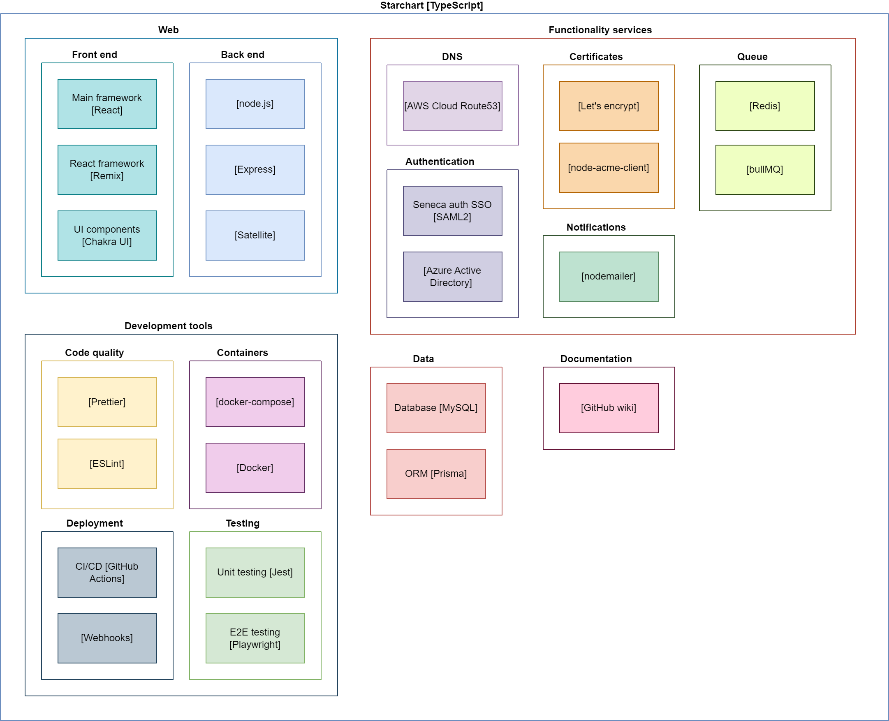

# Starchart 

Starchart makes it easy for the Seneca developer community to create and manage their own custom subdomains and SSL certificates, without cost or having to provide personal information.

For information about running Starchart, see our [deployment guide](docs/deployment.md). For development information, see our [contributing guide](CONTRIBUTING.md). For further technical background, planning, and initial designs, please see the [wiki](https://github.com/Seneca-CDOT/starchart/wiki).

## Introduction

The internet is evolving, and what used to be hard has become simple. For example, hosting your own website used to require knowledge of server administration, operating systems, networking, etc. Today, many developers host their personal and project websites without ever touching a remote server, opting for (free) cloud services like GitHub Pages, Vercel, Netlify, or AWS.

The internet's security model is also evolving. For example, browser vendors have embraced HTTPS everywhere. This is good for security, as it enables certificate-based encryption between clients and servers. However, as with many security best practices, the change has also added complexity to development and deployment.

With the move to HTTPS everywhere, developers wishing to communicate between hosts need to be able to register custom domains and work with SSL certificates. Seneca developers need to build and run many internet services securely, and in a way that can be shared with other teammates, instructors, etc. For example, running a project web site on GitHub or deploying an API with a load balancer on AWS.

Starchart makes it easy to quickly and freely create subdomains and SSL certificates to access these services using a memorable name, and to do so in a secure way.

Working with custom domains and certificates is particularly hard for student developers, who need to work across network hosts to learn and experiment. However, many don't have credit cards (or the money to buy domains), and don't necessarily understand the risks of leaking their personal information via domain registration (i.e., hiding your personal information for a .com domain costs even more money).

Starchart aims to support our educational developer community while they build and deploy services that require custom domains and certificates. It provides time-limited, personalized subdomains and SSL certificates that can be used in various hosting, cloud, or API contexts.

Starchart is not meant to be, or replace commercial registrars; nor is it meant for use outside of our educational/developer context.

## 1.0 Features

- An authoritative DNS server manages a single domain (e.g., `example.com`)
- A Web app and API server allow users to create subdomains for their own use. The server supports [A Records](https://www.cloudflare.com/learning/dns/dns-records/dns-a-record/) (to map a domain name to an IPv4 address), [AAAA Records](https://www.cloudflare.com/learning/dns/dns-records/dns-aaaa-record/) (to map a domain name to an IPv6 address), [CNAME Records](https://www.cloudflare.com/learning/dns/dns-records/dns-cname-record/) (to provide an alias for an existing domain), [MX Records](https://www.cloudflare.com/learning/dns/dns-records/dns-mx-record/) (to direct emails to a mail server), and/or [TXT Records](https://www.cloudflare.com/learning/dns/dns-records/dns-txt-record/) (to return text to DNS clients).
- Seneca faculty and students can use their existing Seneca SSO accounts to authorize and then self-manage unique subdomains, based on their SSO username
- Each authorized user can create subdomains of the form: `{project|host}.{username}.example.com`. For example, the Seneca user `klee` could create: `project123.klee.example.com` or `laptop.klee.example.com`. The `*.klee.example.com` portion of the subdomain is fixed for each user (i.e., the user `klee` can't create subdomains other than `*.klee.example.com`).
- An SSL certificate is also generated for `*.{username}.example.com` using a [DNS Challenge](https://letsencrypt.org/docs/challenge-types/#dns-01-challenge), allowing any subdomains created for this username to be accessed securely.
- Each domain is made available for a time-limited period (for example: "1 term" or "1 year").
- An administration layer to handle abuse or limit users when necessary (for example, being able to remove or blacklist an entire user or subdomain).

## Technologies and components

Here is the planned architecture and [technologies used](https://github.com/Seneca-CDOT/starchart/wiki/Tech-Stack):

