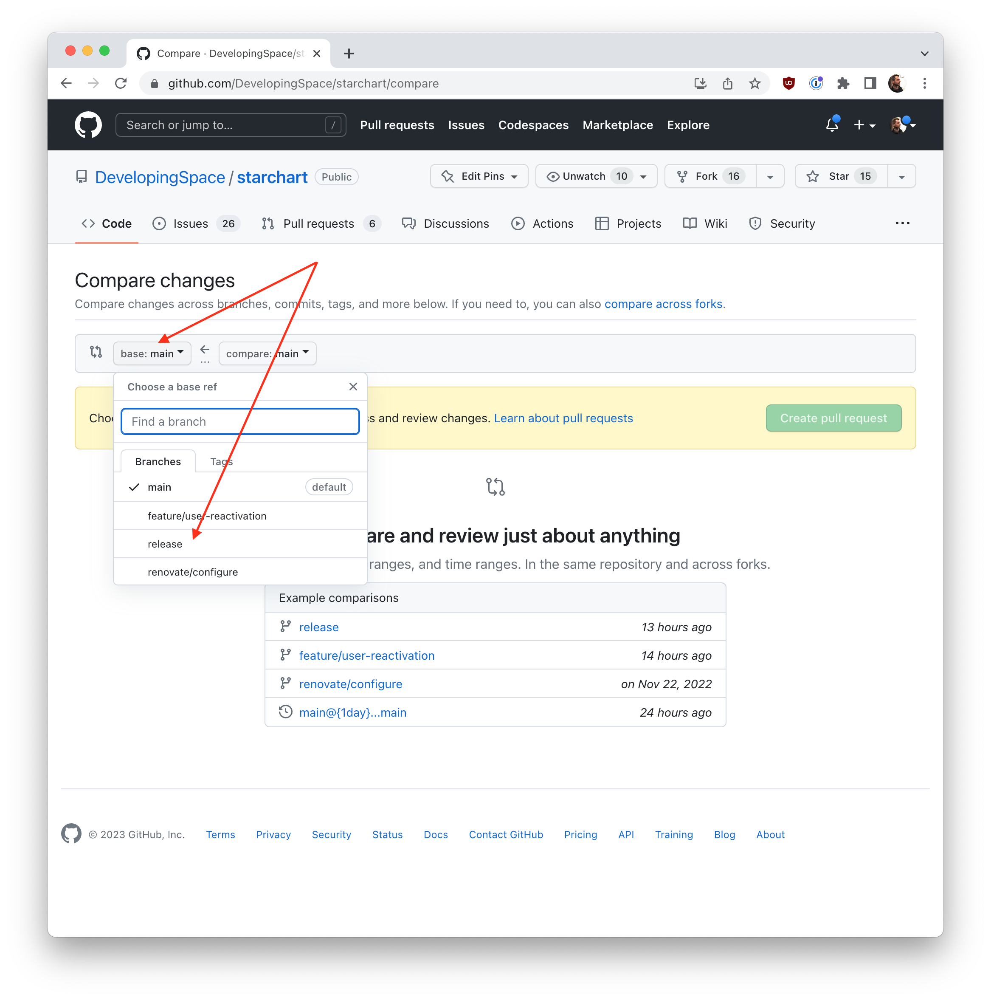
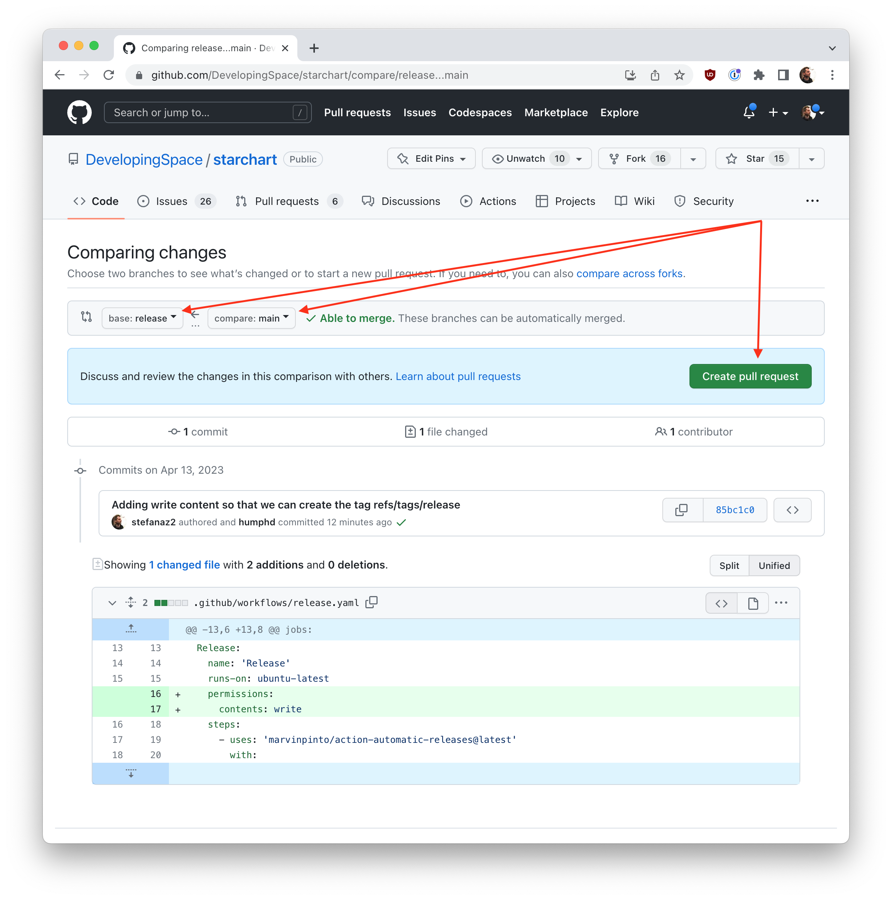
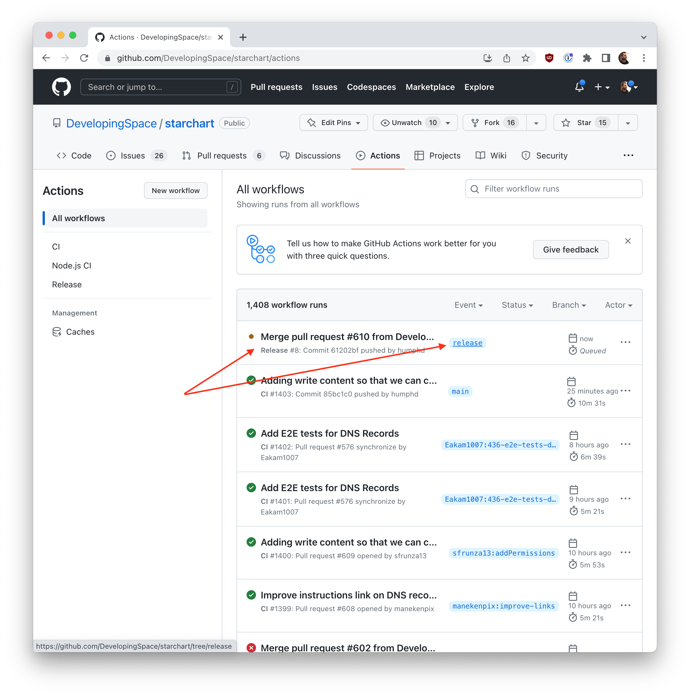
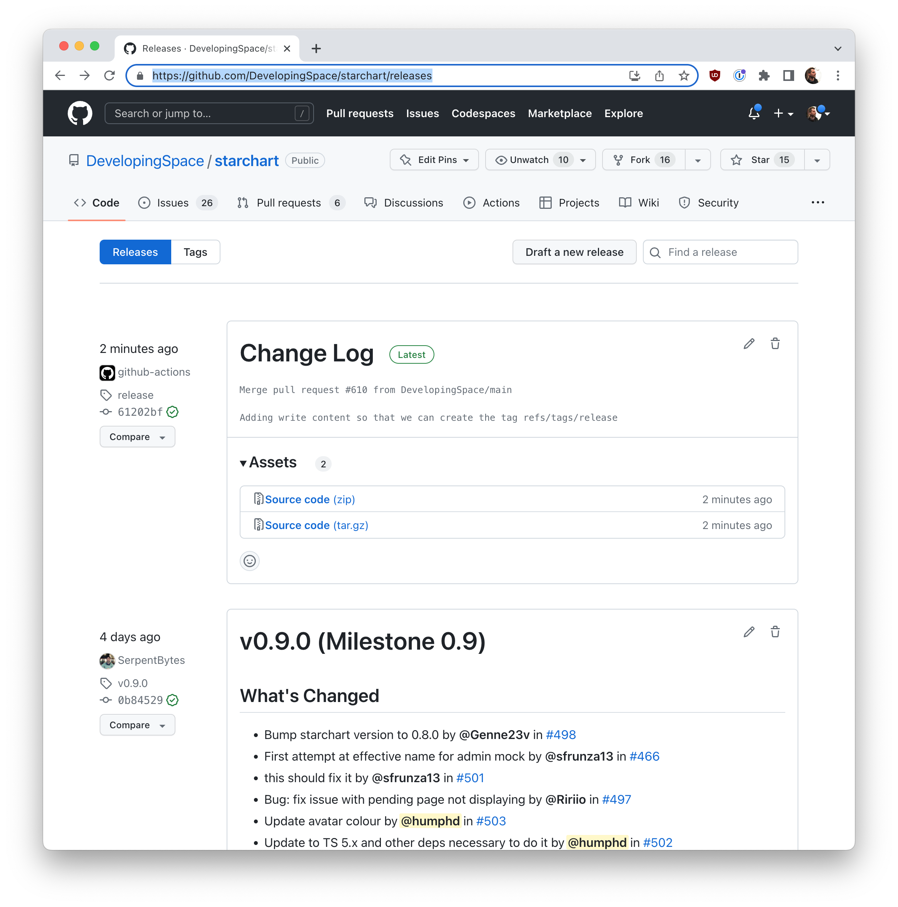

# Deployment

Starchart depends on a number of external services, including:

1. MySQL
2. Amazon Route53
3. An SMTP Server
4. Let's Encrypt
5. SAML2 IdP (e.g., Azure Active Directory)

Starchart also uses Redis, which is run internally via Docker (i.e., not exposed externally).

## Configuration

A number of environment variables and Docker secrets are required at runtime.

### Environment Variables

The following configuration values must be set via environment variables.

| Variable Name                       | Description                                                                                                                                                                                                                                              |
| ----------------------------------- | -------------------------------------------------------------------------------------------------------------------------------------------------------------------------------------------------------------------------------------------------------- |
| `APP_URL`                           | The URL of the server (e.g., `https://mycustomdomain.senecapolytechnic.ca`). NOTE: when running in development, use `http://host.docker.internal:8080` vs. `http://localhost`, so that Docker DNS resolution works between the login container and host. |
| `PORT`                              | The server runs on port `8080` by default                                                                                                                                                                                                                |
| `LOG_LEVEL`                         | The log level to use for log messages. One of `error`, `debug`, `info`, etc. See [Winston docs](https://github.com/winstonjs/winston#logging-levels). Defaults to `info`                                                                                 |
| `ROOT_DOMAIN`                       | The DNS root domain for the hosted zone (e.g., `starchart.com`)                                                                                                                                                                                          |
| `AWS_ROUTE53_HOSTED_ZONE_ID`        | The existing Amazon Route53 Hosted Zone ID to use (e.g., `Z23ABC4XYZL05B`)                                                                                                                                                                               |
| `NOTIFICATIONS_EMAIL_USER`          | The email address from which notifications are sent                                                                                                                                                                                                      |
| `SMTP_PORT`                         | The port to use for the SMTP server. Defaults to `587` in production (using `smtp.office365.com`) and `1025` in development (using ([MailHog](https://github.com/mailhog/MailHog))                                                                       |
| `LETS_ENCRYPT_ACCOUNT_EMAIL`        | The email address to use for the app's [single Let's Encrypt account](https://letsencrypt.org/docs/integration-guide/#one-account-or-many)                                                                                                               |
| `REDIS_URL`                         | The Redis server to use for the worker queues. Defaults to `redis://redis:6379` in production and `localhost:6379` in development.                                                                                                                       |
| `SAML_IDP_METADATA_PATH`            | The file path of the SAML Identify Provider (IdP)'s metadata XML. We store various XML files in `config/` and use `config/idp-metadata-dev.xml` by default.                                                                                              |
| `SECRETS_OVERRIDE`                  | In development, to override the Docker secrets                                                                                                                                                                                                           |
| `DANGER_DATABASE_WIPE_REINITIALIZE` | In staging and production, use `DANGER_DATABASE_WIPE_REINITIALIZE=1` to run extra scripts on startup to create or sync the database with the Prisma schema. NOTE: this **wipes all data** in MySQl and Redis, so be careful!                             |
| `EXPIRATION_REPEAT_FREQUENCY_S`     | The value in seconds used to specify how often to repeat BullMQ jobs to process expired DNS records/certificate expiration                                                                                                                               |
| `JOB_REMOVAL_FREQUENCY_S`           | The value in seconds used to specify how often to automatically remove BullMQ jobs on completion or failure                                                                                                                                              |

### Secrets

The following secrets must be added to the Docker engine using [Docker Swarm secrets](https://docs.docker.com/engine/swarm/secrets/).

| Secret Name                            | Description                                                                                                                                                                  |
| -------------------------------------- | ---------------------------------------------------------------------------------------------------------------------------------------------------------------------------- |
| `AWS_ACCESS_KEY_ID`                    | The AWS Account Access Key ID for use with Route 53                                                                                                                          |
| `AWS_SECRET_ACCESS_KEY`                | The AWS Account Secret Access Key for use with Route 53                                                                                                                      |
| `LETS_ENCRYPT_ACCOUNT_PRIVATE_KEY_PEM` | The RSA Private Key for the Let's Encrypt account, in PEM format                                                                                                             |
| `SESSION_SECRET`                       | The long, random string to use for keying sessions                                                                                                                           |
| `NOTIFICATIONS_USERNAME`               | The SMTP username to use for sending notifications                                                                                                                           |
| `NOTIFICATIONS_PASSWORD`               | The SMTP password to use for sending notifications                                                                                                                           |
| `DATABASE_URL`                         | The MySQL database connection string URL. NOTE: this is needed as an environment variable only when doing database setup commands, but read as a secret when running the app |

## Running the App via Docker Swarm

### Enable Docker Swarm

To use Docker Swarm and Docker Swarm Secrets, the Docker Engine must be in swarm mode. To start a node as a Manager, use `docker swarm init`:

```sh
$ docker swarm init
Swarm initialized: current node (z2kzrlomvm4f05ru94zksw5iu) is now a manager.

To add a worker to this swarm, run the following command:

    docker swarm join --token SWMTKN-1-0pnx5m0x6seoezo5w1ihru2kjuffvmloqmq9uc0tqsx6uigjnt-daiis27rzreqzspzko70kijah 192.168.64.11:2377

To add a manager to this swarm, run 'docker swarm join-token manager' and follow the instructions.
```

To join a Worker to an existing swarm (i.e., manager), use the `docker swarm join` command, including the token for the manager. See command above for an example.

### Docker Secrets

The various secrets need to be set up with the Docker engine on the manager node. To create a secret, use one of the following forms:

```sh
# Secret from string (if you use this method, clear out your shell history after)
$ printf "my-super-secret-password" | docker secret create my_password -

# Secret from file contents
$ docker secret create my_key ./privkey.pem
```

Once all secrets are created, they can be listed using:

```sh
docker secret ls
```

They can also be removed:

```sh
docker secret rm my_password
```

All secrets listed above need to be created.

### Database Setup

The first time the app is run, or whenever the database schema is altered, the database needs to be set up using Prisma.

To do this, run the `starchart` container as a service, with the additional environment variable `DANGER_DATABASE_WIPE_REINITIALIZE=1` (NOTE: this will **wipe** all data in MySQL and Redis, so be careful!).

Modify the `compose.yaml` you are using (e.g., `compose.staging.yaml` or `compose.production.yaml`) and add `DANGER_DATABASE_WIPE_REINITIALIZE=1` in the `environment` section of the `mycustomdomain` service. You can (and should!) remove this after you get the database set up, especially on production, so that re-deploying doesn't wipe the database.

### New Changes to the Database Schema

Because staging and production use Prisma migration, changes in the schema need to become migration files for Prisma migration to run the files to apply changes. A migration file is essentially a set of SQL queries Prisma generates that would get a database to a desired state, by comparing your current schema and the latest migration file.

After any changes are made to the `prisma/schema.prisma` file, a new migration file needs to be created (i.e., so it can be applied to the production databases). To make a new migration file, run `npm run db:migration`, while running the project's MySQL database container in Docker locally. You will be prompted to give the file a name.

**WARNING:**
Outside of special circumstances, please **DO NOT** change the schema without using Prisma migration on staging and production. It will very likely cause issues with database migration. It will then require manual fixing to get the migration history sorted out.

Think of Prisma migarion as git tracking your commits, and manually fixing git history can be complicated. See [official documentation](https://www.prisma.io/docs/guides/migrate/developing-with-prisma-migrate/troubleshooting-development) for how to do it.

### Deploying

To deploy or update the app:

```sh
# Use the correct YAML file for your deployment, and name the service `starchart`
docker stack deploy -c compose.staging.yal starchart
```

To stop and remove the serivce:

```sh
docker stack rm starchart
```

You can then view logs for any of the services by name (e.g., `mycustomdomain` container inside the `starchart` service):

```sh
docker service logs --follow starchart_mycustomdomain
```

The logs are handled by the [journald](https://docs.docker.com/config/containers/logging/journald/) log driver. They can also be accessed via `journalctl`:

```sh
# See logs for mycustomdomain container(s)
sudo journalctl -b CONTAINER_TAG=mycustomdomain
# See logs for redis container
sudo journalctl -b CONTAINER_TAG=redis
```

To see the status of a service across all nodes in the swarm:

```sh
# Get a list of all services
docker service ls

ID             NAME                       MODE         REPLICAS   IMAGE                                    PORTS
jo5utyyq92rb   starchart_mycustomdomain   replicated   2/2        ghcr.io/developingspace/starchart:main   *:8080->8080/tcp
a6qal8e8epaf   starchart_redis            replicated   1/1        redis:7.0.9-alpine3.17

# See what's happening with the starchart_mycustomdomain service
docker service ps starchart_mycustomdomain
ID             NAME                             IMAGE                                    NODE                                       DESIRED STATE   CURRENT STATE             ERROR                              PORTS
cez1iwflx2iq   starchart_mycustomdomain.1       ghcr.io/developingspace/starchart:main   cudm-mgmt01dv.dcm.senecapolytechnic.ca     Running         Running 45 minutes ago
8795mbqcd2rz    \_ starchart_mycustomdomain.1   ghcr.io/developingspace/starchart:main   cudm-mgmt01dv.dcm.senecapolytechnic.ca     Shutdown        Rejected 48 minutes ago   "No such image: ghcr.io/develo…"
8u3hv2vvxr1k    \_ starchart_mycustomdomain.1   ghcr.io/developingspace/starchart:main   cudm-mgmt01dv.dcm.senecapolytechnic.ca     Shutdown        Rejected 48 minutes ago   "No such image: ghcr.io/develo…"
cb9hlc5cabql    \_ starchart_mycustomdomain.1   ghcr.io/developingspace/starchart:main   cudm-mgmt01dv.dcm.senecapolytechnic.ca     Shutdown        Rejected 48 minutes ago   "No such image: ghcr.io/develo…"
m4vokttzr1nq    \_ starchart_mycustomdomain.1   ghcr.io/developingspace/starchart:main   cudm-mgmt01dv.dcm.senecapolytechnic.ca     Shutdown        Rejected 49 minutes ago   "No such image: ghcr.io/develo…"
2hb3xbh8to59   starchart_mycustomdomain.2       ghcr.io/developingspace/starchart:main   cudm-worker01dv.dcm.senecapolytechnic.ca   Running         Running 2 minutes ago
```

Here we can see the state of each container running on the nodes in the swarm. Some are `Running` and others `Shutdown`, and the number `.1` or `.2` shows the instance and which node it is `Running` on in the swarm (e.g., `starchart_mycustomdomain.2` is running on `cudm-worker01dv.dcm.senecapolytechnic.ca`).

## Automatic Webhook Deployment Setup

Automatic deployments from GitHub Actions are done via a webhook in a continuous integration workflow. See the [Webhook Deploy docs in webhook/](webhook/README.md) for details about how to setup the deployment webhook.

## Maintenance

Docker will use lots of disk space, especially as new deployments come in via the webhook, and older images aren't used anymore.

Create a cron job that runs daily at `/etc/cron.daily/docker-prune`, which cleans out unneeded Docker objects:

```sh
#!/bin/bash

# Clean-up all unused images, volumes, etc not being used by containers
# The volumes we use can be blown away as well, all long-term state is in MySQL
docker system prune --all --volumes --force
```

Now make this executable, and test it:

```sh
sudo chmod +x /etc/cron.daily/docker-prune
sudo run-parts /etc/cron.daily
```

Repeat this process on all nodes in the swarm.

## GitHub Automated Release Flow for Staging and Production

Once setup on staging and production, updates can be automatically released via GitHub. Automatic releases are managed via our [GitHub Actions Workflows](./.github/workflows/) and triggered as follows:

- Merging code to `main` automatically deploys to **staging**
- Merging code to `release` automatically deploys to **production**

### Production Release Workflow

We deploy to production from the `release` branch. When `main` is in the desired state, and has been tested on staging, promoting the code to production works as follows:

1. A maintainer creates a new **Pull Request** from the GitHub UI:


2. Merge all changes in the `main` branch _into_ the `release` branch by selecting the `release` branch as the **base ref**:



3. Confirm that you are merging `main` _into_ `release` and click **Create pull request**:



4. Update the title and description if desired, or leave as is. Read through all changes that are about to get added to `release`, making sure there's nothing in it that will cause data loss (e.g., database changes), require changes on the production infrastructure (e.g., changes to Docker setup), etc. and click **Create pull request**:


5. Get a review. NOTE: all changes have already been fully reviewed and tested before being merged in `main`, so this process is about making sure that we can ship these changes to production as-is. For example: does this need any special database or system updates outside the scope of the code changes?

6. Merge the pull request with a **merge commit** (i.e., _not_ a **squash** or `**rebase**). We use a **merge commit** in order to keep the commits the same in both branches, making it easier to revert a single commit later on:


7. Confirm that the pull request has triggered a GitHub Actions run on `release`, and that it succeeds:



8. Confirm that a new **Release** has been created:


